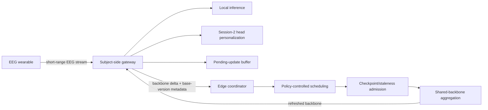

# NEXUS-MI

**Communication-Aware Federated Personalization for Gateway-Coordinated Motor-Imagery Brain-Computer Interfaces**

NEXUS-MI is a deployment-centered federated personalization framework for motor-imagery BCI that addresses a gap largely overlooked in existing federated MI-BCI studies: the effect of imperfect gateway coordination on the personalized decoder ultimately used by each subject. Federated learning enables collaborative model adaptation without centralizing raw EEG, but most prior MI-BCI studies assume regular synchronization and do not examine how intermittent gateway availability, delayed or stale updates, buffering, participant selection, and backbone distribution interact with personalization. NEXUS-MI makes these coordination decisions part of the learning system itself and evaluates how they affect both subject-level decoding performance and communication cost under heterogeneous links.

During the gateway-coordinated phase, each subject-side gateway retains raw EEG, calibration labels, and its personalized classifier head locally, while an edge coordinator maintains a shared EEGNet backbone. EIB-PH additionally uses pooled Session-1 data for predeployment backbone initialization. The repository reproduces the paper's ideal-link reference, six P1–P6 gateway coordination policies, the controlled P3/P5 comparison, P5 component analysis, link-availability sensitivity analysis, and five-realization robustness analysis.

## What is in this repository

- one experiment driver (`src/nexus_mi/experiment.py`) covering the complete study protocol;
- EEGNet architecture and gateway-local training/personalization helpers used by the study;
- portable BCICIV-2a and OpenBMI preprocessing;
- experiment presets matching the study protocol;
- data-driven plotting code for manuscript Figures 2–7.

**The EEG datasets are not bundled.** Users download them from the official providers and process them locally.

## System overview



Raw EEG, calibration labels, and personalized classifier heads remain gateway-local during the gateway-coordinated phase. The experiments instantiate this deployment workflow by replaying the public session-based datasets offline.

## Installation

```bash
git clone https://github.com/WadElla/NEXUS-MI.git
cd NEXUS-MI
python -m venv .venv
source .venv/bin/activate
pip install -U pip
pip install -e .
```

A CUDA-enabled PyTorch installation is recommended for the full experiment suite.

## Data preparation

See [`data/README.md`](data/README.md). A typical setup keeps the large EEG data outside the repository. Point `--source` at files downloaded from the public dataset providers; source discovery is recursive and can be checked before preprocessing:

```bash
export NEXUS_MI_DATA_DIR="$HOME/nexus-mi-data"

nexus-mi inspect-source bciciv2a --source /path/to/BCICIV2a
nexus-mi prepare bciciv2a --source /path/to/BCICIV2a

nexus-mi inspect-source openbmi --source /path/to/OpenBMI
nexus-mi prepare openbmi --source /path/to/OpenBMI

nexus-mi validate-data bciciv2a
nexus-mi validate-data openbmi
```

## Reproduce the paper experiments

### Ideal-link reference

```bash
nexus-mi run ideal --dataset bciciv2a
nexus-mi run ideal --dataset openbmi
```

The ideal-link condition is the unconstrained synchronization reference for the same learning protocol; it is not treated as an empirical accuracy ceiling.

### Primary P1–P6 policy landscape

```bash
nexus-mi run primary --dataset bciciv2a
nexus-mi run primary --dataset openbmi
```

The policies are:

| Policy | Scheduling | Offline update | Delayed/stale admission | Backbone download |
|---|---|---|---|---|
| P1 | non-adaptive all-gateway | discard | no delayed update | always/current when selected |
| P2 | non-adaptive all-gateway | FIFO | accept if base retained | always/current when selected |
| P3 | non-adaptive all-gateway | FIFO | drop if lag > 2 | always/current when selected |
| P4 | non-adaptive all-gateway | latest pending | drop if lag > 2 | always/current when selected |
| P5 | communication-aware priority | FIFO | drop if lag > 2 | refresh if local lag > 1 |
| P6 | communication-aware priority | latest pending | drop if lag > 2 | refresh if local lag > 1 |

### P5 component analysis

```bash
nexus-mi run component --dataset openbmi
```

This is the OpenBMI EIB-PH experiment comparing P3, online-random selection, online-priority selection, stale-aware download only, and full P5. FIFO buffering and stale-drop admission remain fixed.

### Availability sensitivity

```bash
nexus-mi run sensitivity --dataset bciciv2a
nexus-mi run sensitivity --dataset openbmi
```

This evaluates P3/P5 under mild `0.98/0.85/0.60`, default `0.95/0.70/0.40`, and severe `0.90/0.50/0.20` high/moderate/low gateway availability.

### Five-realization robustness

```bash
nexus-mi run robustness
```

The robustness suite executes the matched P3/P5 repetitions for both datasets and both SB-PH/EIB-PH regimes. Model seeds are 2026–2030, availability-trace seeds are 12026–12030, P5 scheduler tie-break seeds are 22026–22030, and the gateway-group seed is fixed at 2026. Within each matched P3/P5 replicate, the model initialization, realized availability trace, gateway groups, Session-2 partition, and calibration samples are shared.

> Full reproduction is GPU-intensive. The commands above use the paper protocol; any reduced-round or reduced-epoch diagnostic run is not a paper reproduction.

## Analyze a reproduction

After the required experiment suites finish, derive the publication results **from the generated run directories**:

```bash
nexus-mi analyze
nexus-mi figures
```

`analyze` creates `outputs/publication_analysis/` with the complete operating points, calibration-budget means, the controlled P3/P5 operating points and paired statistics, component analysis, subject-level reliability, sensitivity analysis, subject-association analysis, and robustness Tables S2–S5. `figures` regenerates manuscript Figures 2–7 from those analyzed outputs.

For a full end-to-end reproduction after both datasets are prepared:

```bash
./scripts/reproduce_all.sh
```

## Paper protocol

- **Datasets:** BCICIV-2a (9 subjects, 4 classes) and OpenBMI (54 subjects, 2 classes).
- **Session protocol:** Session 1 collaborative backbone learning; Session 2 limited-calibration head personalization and held-out evaluation.
- **Calibration:** `k={15,20,30}` trials per class.
- **Backbone:** EEGNet, 4-s epochs at 250 Hz; 22 BCICIV-2a channels and selected 20-channel OpenBMI montage.
- **Federated learning:** 120 communication rounds, 50 local epochs per newly produced update, Adam `1e-3`, batch size 16, uniform update-instance aggregation.
- **Head personalization:** the shared backbone is held fixed and only the subject-specific classifier head is optimized with Adam `5e-5` (max 750 epochs, patience 100).
- **Communication:** FIFO capacity 3 where enabled, stale threshold 2 versions, checkpoint-retention margin 5 versions, stale-aware download threshold 1 version, selection budget 6 (BCICIV-2a) / 40 (OpenBMI).
- **Primary seed:** 2026.

The `nexus-mi run ...` presets read [`src/nexus_mi/paper_protocol.yaml`](src/nexus_mi/paper_protocol.yaml) for the study run hyperparameters. The EEGNet architecture is fixed in the runtime. See also [`docs/EXPERIMENTS.md`](docs/EXPERIMENTS.md), [`docs/REPRODUCIBILITY.md`](docs/REPRODUCIBILITY.md), and [`docs/ENVIRONMENT.md`](docs/ENVIRONMENT.md).

## Expected results

Selected results from the paper that can be used to compare a completed reproduction include:

- OpenBMI EIB-PH: P3 80.13% vs P5 81.12%; P5 reduced S2C backbone traffic from 37.49 MB to 21.98 MB (41.38%).
- BCICIV-2a: P4 was the highest primary mean under both SB-PH (68.88%) and EIB-PH (69.80%).
- Across five matched P3/P5 realizations, S2C reduction remained about 42% on both datasets while all crossed hierarchical-bootstrap 95% CIs for the accuracy difference included zero.

## Repository layout

```text
NEXUS-MI/
├── src/nexus_mi/          # runtime, study protocol, preprocessing, model, experiment driver
├── scripts/               # convenience run scripts
├── data/                  # instructions only; EEG data are git-ignored
├── outputs/               # generated locally and git-ignored
├── docs/                  # experiment, environment, and reproducibility notes
```

## Data locality and scope

During the gateway-coordinated phase, raw EEG, calibration labels, and personalized classifier heads remain at the subject-side gateway. EIB-PH additionally uses pooled Session-1 data for predeployment backbone initialization. The study is an **offline replay-based evaluation** of public laboratory datasets, not a live wearable deployment, and it does not evaluate secure aggregation, differential privacy, or encrypted computation.

## Model architecture

The shared backbone is **EEGNet**, introduced by Lawhern et al. The implementation in this repository is configured to match the NEXUS-MI experiments (`F1=8`, `D=2`, `F2=16`, `C1=125`, dropout 0.5), with dataset-specific channel and class counts.

## Citation

If you use this repository, please cite the NEXUS-MI paper (citation metadata will be updated with the final venue/DOI after publication) and the original dataset/model sources used in your experiment. For EEGNet, cite: V. J. Lawhern, A. J. Solon, N. R. Waytowich, S. M. Gordon, C. P. Hung, and B. J. Lance, “EEGNet: a compact convolutional neural network for EEG-based brain-computer interfaces,” *Journal of Neural Engineering*, vol. 15, no. 5, 056013, 2018.

## License

Code in this repository is released under the MIT License. Applicable third-party software notices are retained in [`THIRD_PARTY_NOTICES.md`](THIRD_PARTY_NOTICES.md). Dataset licenses/terms are controlled by the original dataset providers; the datasets are not redistributed here.
